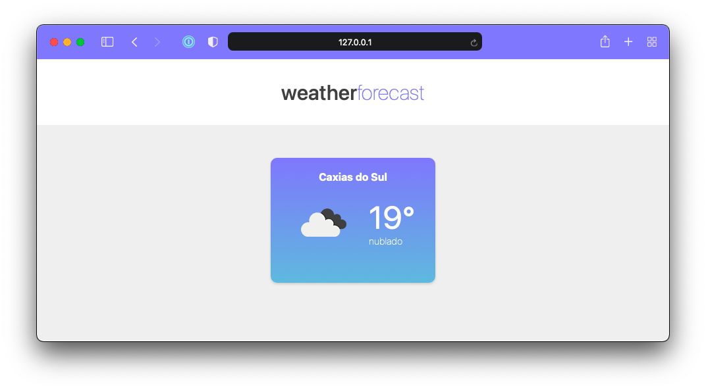
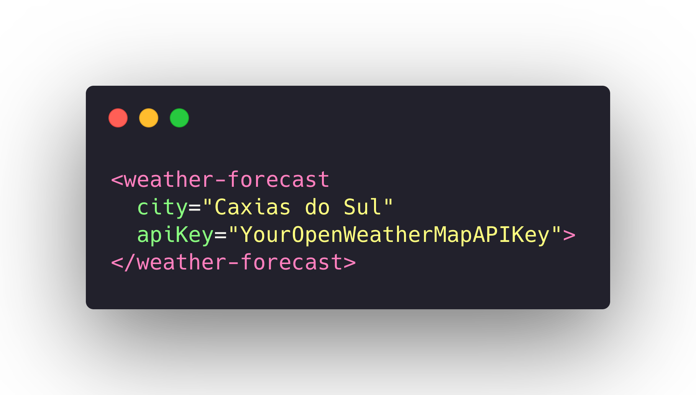

# Weather Forecast Web Component

> A simple demo of a Weather Forecast Web Component

## Support

- [Custom Elements](https://caniuse.com/custom-elementsv1)
  - One of the key features of the Web Components system, custom elements allow new HTML tags to be defined.
- [Shadow DOM](https://caniuse.com/shadowdomv1)
  - Method of establishing and maintaining functional boundaries between DOM trees and how these trees interact with each other within a document, thus enabling better functional encapsulation within the DOM & CSS.
- [HTML templates](https://caniuse.com/template)
  - Method of declaring a portion of reusable markup that is parsed but not rendered until cloned.

## License

This package is licensed under the [MIT license](https://magno.mit-license.org/2021). Copyright © Magno Biét
